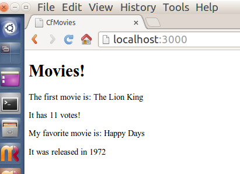

#4.2 - New Models
Due Thursday by 11:59pm
Points 10
Submitting a website url or a file upload
File Types png, jpg, jpeg, tiff, and bmp
Objective: Understand how to create models programmatically from the 'rails console'.

 1. Continue from where #4.1 left off.
 2. From the rails console add your favorite movie.
 3. In the home action in your pages controller, set @my_favorite to using the find_by method on the Movie model.
 4. Make a new paragraph on the home page, with a sentence saying: My favorite movie is YOUR_FAVORITE_MOVIE_TITLE.
 5. Make a new paragraph saying: It was released in YEAR.
 6. Commit and push your work to your repository.
 7. Take a screenshot of the home page showing your favorite movie!
 8. Link to your commit on GitHub! 
 9. Add a comment and a well formed question.

If you need help, check the "Basic Resources" module and the Hints discussion linked in this weeks modules.

Results:

***
#4.1 - Models
Due Thursday by 11:59pm 
Points 10 
Submitting a website url
Objective: Understand how to find and display models.

 1. Open a terminal, cd to your projects folder (where you are doing your work)
 2. Fork the cf-movies repository: https://github.com/nearapogee/cf-movies.
 3. Clone your fork of the repository.
 4. Route the root to the pages controller and the home action.
 5. Fill in the missing pieces of information on the home page
 6. Commit your work.
 7. Push your work back up to your repository.
 8. Submit the browser URL of your repository for credit.
 9. Add a comment and a well formed question.

If you need help, check the "Basic Resources" module and the Hints discussion linked in this weeks modules.
